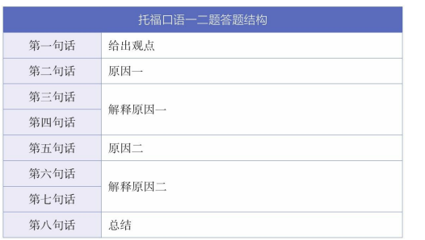
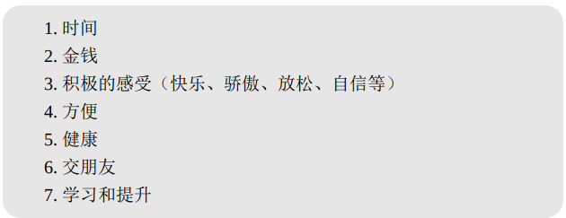
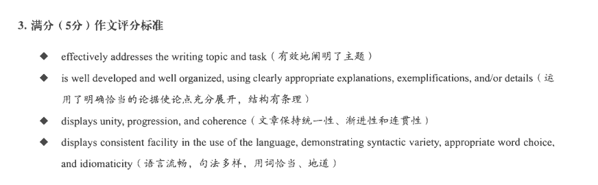
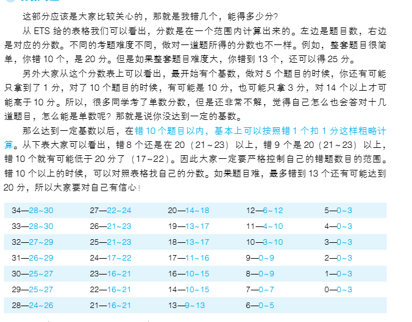

## toefl 模式敲定
一个月内考试  12 8日 以及 14日 
剩下要等明年

阅读 口语 写作 都可以进行联动

备考正式开始时间 11月9日 开始背绿宝书

去年成绩...

绝对薄弱的 听力、稀烂的口语和写作、以及还有提升空间的阅读

## 生词

每日墨墨背单词   空余时间任务解决。  X(还是直接用书好，可以把模糊的单词界限搞清楚)

绿宝书启动 每天2个LIST  24天完成，每日大约 3~4 h 

## 阅读
题目模式为 2学术  35min
与口语写作的关联性? 

## 口语

流利度提升关键：同一个话题反复联系

举个例子，2019年1月13日的考试问到：“如果你有个外国朋友
来你的国家旅游，你会建议他做或者不做什么来显示充分的尊重和礼
貌？”我的一个学生回答说，建议他不要把筷子插在米饭里，因为不吉
利。这么做很像是在祭祀的时候插的香，是很没有礼貌的。说实话，想
法很丰满，有理有据。但是现实很骨感，他发现语言限制了自己的表
达。比如，“插”用哪个词？“祭祀”怎么说？“香”又应该怎么说？

选择自己最会说的那句话

题目模式为 1 独立 + 3 综合  16min

独立口语部分： 15秒准备，45秒回答 7-8句话  单词从71 ~ 164

如果给不出两点原因，可以背万能公示

即使满分的回答，也是允许犯错误的，无论是词汇还 是语法。

因此**不必使用高级词汇替换常用词**

其次，大家可以运用现有的**TPO资源**来累积口语表达中所需要的 词汇和语法。

最后，大家也可以采用“**答—录—听—改**”的方式来词汇积累。

也就是所谓的 **口语单独积累词汇**

换句话说，**好的发音**对你来说只是**锦上添花**，绝不是雪中送炭。实 际上，有很多国家的人，由于母语所带来的影响，在说英语的时候都会 夹杂着自己的口音。但是这并不妨碍他们与英语母语者沟通和交流。

**「流利不等于快」**

在我们的答题过程中，只要没有明显的、经常性的卡壳，就是流 利。所以，我们完全可以**放慢语速，降低难度**，用7-8句话，给出一个 流利的回答。

对于综合口语，会给出阅读材料并给出段对话。最后会让你去总结那个对话

节奏就是  看->听->总结和回答

还是得背板子

基本都是 抛出观点->拓展2-3个idea ->总结

## 写作
题目模式为 1综合 1 学术讨论  29min

## 听力 
题目模式 3 lecture  2对话  26min

坚持每天精听 2-3 。目前看来还是以话题分类为主可能更加易于学习

 一个是很多人背单词的时候**不喜欢背发音** 第二个原因， 就是听力里的单词都不是单独出现的， 有时候**有吞音连读**，解决的方法： 一是背单词的时候要通过**听读的方式背**。 另外就是多通过 **跟读对话来熟悉吞音连读的情况**

托福听力是以**美音为最核心**的音频。 近几年偶尔会出现英式发音。

就目前的考试来看， 听力的**加试题， 大多都是经典加试**。 大家考完试之后回忆出来的题目  **主要就两套**， 大家把这两套的题目概述和答案准备一下就好。

新托福听力所考查的就是大家能否抓住**主要内容**的能力， 能否忽略**细小的细节**抓住最主要  的结构

结构分析法听听力

a. 主题 b. 定义 c. 因果 d. 过程 e. 例子  f. 转折 g. 强调 h. 列举 i. 比较 j. 总结

**记笔记**

缩写，抓主旨，练习抓核心

**分析错题**

托福考题错误选项是很有规律的， 我们要学会**分析错误选项**。 分析选项的能力如果能提  高， 会在你听不懂内容的情况下， 帮助你答对题目。 

**抓标志性结构**

例如， 只要听到**分类列举**， 就一定要记笔记。 **标志性的句子**是： “ There are three major  reasons for…”“ There are two major types of glaciers. One is…the other is…” 一般自己预期  的是后面会出现一道搭配题或者是判断题。  

只要听到录音中老师说 “ Remember！ Keep that in mind！ One important element in…A  very interesting theory about this is…”， 证明是在强调， 应该预期会出一道相关的细节题。  只要听到 “ different ， distinguish， distinction， similar， same”， 不管是在任何时候， 都要  注意听对比， 肯定会有一道题目考查这个。 

 只要在开头听到 “ development ， formation， process， procedure， approach”， 就一定要  注意预期过程和步骤， 必定会考某种形式的排序题。

 只要听到表示顺序的词语， 一定要记笔  记， 否则光靠听会漏掉细节。

  只要听到例子，“ say…， take…for example， for instance…”， 就一定要仔细听这个例子  到底在说明什么道理。 可以不写太多， 但是一定要抓住老师为何说这个例子。 几乎每个讲座都  会考老师为什么提到每个例子。  

只要听到总结 “ to sum up， in summary”， 一定要注意听总结的内容。 很多推断题， 预测  题， 都是对讲座最后一点的推断， 绝对不能放掉。  每次在泛听和记笔记的时候， 都应注意抓住这些信息点。 然后结合题目， 看自己的笔记是  否能和题目的出题点对应上。 每次做题都分析错误的原因， 以便下次在记笔记的时候能更加  准确。  如果练习不够， 就会影响答题效果。

**什么资料复习**

现在的最专业的考试复习材料就是 TPO 真题， 所以建议大家围绕真题复习。 如果听  力辨音能力差， 可以用最早的旧托福的 Part C 训练听写。 基础提高后， 可以从 TPO1 10，  TPO11 20， TPO21 30 这样**分阶段训练**。 如果你的时间比较充裕， 就从第一个十套开始练习  精听加做题。 如果复习时间有 2 个月左右， 可以从 TPO11 开始练习。 如果只有一个月左右的  复习时间， 可以从 TPO21 开始练习。 **最后 TPO30 以后的题目可以留做模考使用**。 随着题目的  增多， 大家将会有更多题目练习的时候， 从 TPO21 开始训练就比较符合考试的难易程度。  TPO 真题可以在托福官方网站上购买， 也可以在张艳英语网找到相关资讯。

自己干话题分类可能**把握不好时间**

**每天量**

其次， 每天至少保证听 **TPO 的一个 section**， 练习**两个讲座和一个对话**。 在基础比较薄弱  的初期， **每天听一个讲座或者一个对话**即可， 不要贪多。 要做精细化练习， 每个讲座都按照结  构听力法所说的结构去**抓主要信息**， 练习记笔记或者听的反应能力。  

再次， 提高听力基础必须要**练习精听**。 鉴于托福考试的讲座很专业， 有很多**词汇考试过后  基本不会再用**， 所以我不**太建议全部精细听写**。（ 精听方法见下文） 讲座和对话都可以使用这  种精听方法。 一句话可以反复听， 直到自己都听懂为止。 遇到生词要单独摘抄在一个本子上。  这样复习的词汇更加精准。 对于发音和听音有困难的同学， 可以练习跟读， 也可以练习听写。  （ 听写对于提高听力的整体把握能力并不是最有效的） 如果大家在发音上很有困难， 可以挑选  一部分 TPO 的题目， 或者用旧托福的材料进行听写

Type 2 总分 【 基础为 30 / 40 ， 目标为 60 / 70 分左右】 听力 10 ～ 15 分  症状： 有一定的词汇量， 但是背得不熟练。 很多词汇都是有模糊的概念， 但是容易混  淆。 单词的发音不熟悉。 有些单词只限于阅读识别， 到听力中就无法听清， 更无法反应  意思。 还有一些是因为不理解词组的意思。 对句子的语法结构认知基础比较差， 一句话  反复听能够听懂， 但是如果是一次性听， 就无法理解。 而且只要句子连成段落或者文章  就听不懂了。 

 复习方案

单词训练：  主攻四级词汇的精细背诵， 并配合托福听力单项词汇的听写 （ 只要听到单词的发音能缩  写， 并在大脑中反应出来意思即可）。

听力训练：  主要练习内容精听、 跟读。 有辨音问题的同样可以听写。 材料还是选择 TPO1 10 或者  TPO11 20 的文章都可以。 精听练习需要听懂句子的结构及句子之间的结构。  

精听要求：  1. 首先能快速判断句子里的核心信息， 并找到哪些词是最重要的。 这个需要配合语法的  学习， 要理解句子的语法结构。  2. 听清句子的剩余部分， 并且力求理解上无死角， 背诵陌生词汇。  3. 重要的词组可以进行跟读。

跟读要求：  读内容的时候是不能看文本的， 听一句， 凭借印象重复出来听的内容。 也可以称之为原词  的复述。 如果不能整句跟读， 就半句或者以一个词组为单位跟读。 目的是练习连贯性， 练习大  脑的短期记忆能力。 整篇文章不必每句都跟读。 大家可以找到难度适中的句子， 跟读 10 句左右足矣。 这个是基本功练习， 只要读了就有效， 读一句有一句的效果， 所以不必贪多。
