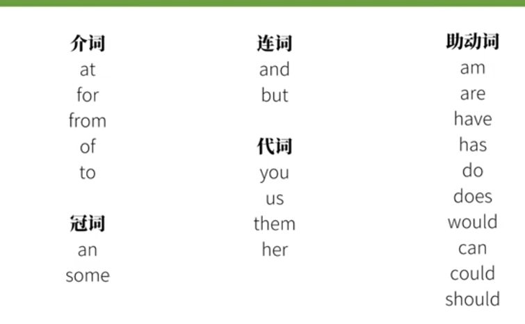
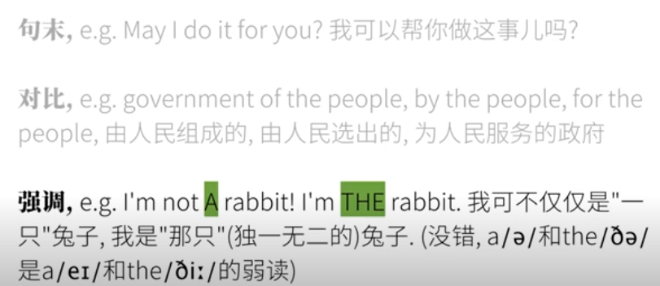

目前的想法是，如果一个生词多次出现则进行记忆，如果没有则暂时不用记，后面需要根据话题进行整理之类的东西。

看到一些评论

阿西吧我一天就光记单词去了，没怎么练习听力，听力也得4h。我龟龟

这个十分可爱的小姐姐说，不要做愚蠢的精听。我大彻大悟，就是连中文，你都无法做到精准听写背诵，何况英语。所以我的改良就是，一是绝对意义上的理解，二是发音。将关键信息提取就够了。

# 弱读

****

变为    

Can 和 Can't 在美音中的部分

can 会  弱音 

但是还是有时候会为了强调读为 can 就连母语着也无法确认是哪种

判断方法是 can 会短一拍 can't 长一拍

我们老师讲阿美口音如果区分：

 1）i can do it ，重音在do，can被弱读。

 2）I can't do it 重音在can't ，do 被弱读。 所

以两句听起来一个是i can Do it

 一个是i CAN'T do it

### **1. 冠词**

- a / an
  - 强读：/eɪ/, /æn/
  - 弱读：/ə/, /ən/
  - 例：I saw **a** dog. /aɪ sɔː ə dɒɡ/
- the
  - 强读：/ðiː/（元音前）
  - 弱读：/ðə/（辅音前）
  - 例：**The** apple is red. /ðə ˈæpl ɪz red/

------

### **2. 介词**

- of
  - 强读：/ɒv/
  - 弱读：/əv/, /ə/
  - 例：A piece **of** cake. /ə piːs ə keɪk/
- to
  - 强读：/tuː/
  - 弱读：/tə/
  - 例：I want **to** go. /aɪ wɒnt tə ɡəʊ/
- for
  - 强读：/fɔːr/
  - 弱读：/fər/
  - 例：This is **for** you. /ðɪs ɪz fər juː/

------

### **3. 连词**

- and
  - 强读：/ænd/
  - 弱读：/ənd/, /ən/, /n/
  - 例：You and me. /juː ən miː/
- but
  - 强读：/bʌt/
  - 弱读：/bət/
  - 例：I like it, **but** not too much. /aɪ laɪk ɪt bət nɒt tuː mʌtʃ/

------

### **4. 助动词**

- is
  - 强读：/ɪz/
  - 弱读：/z/, /s/
  - 例：She **is** happy. /ʃi z ˈhæpi/
- are
  - 强读：/ɑːr/
  - 弱读：/ər/
  - 例：They **are** coming. /ðeɪ ər ˈkʌmɪŋ/
- was / were
  - 强读：/wɒz/, /wɜːr/
  - 弱读：/wəz/, /wər/
  - 例：He **was** there. /hi wəz ðeə/
- have / has / had
  - 强读：/hæv/, /hæz/, /hæd/
  - 弱读：/əv/, /əz/, /əd/
  - 例：I **have** seen it. /aɪ əv siːn ɪt/

------

### **5. 人称代词**

- him / her / them
  - 强读：/hɪm/, /hɜːr/, /ðem/
  - 弱读：/ɪm/, /ər/, /ðəm/
  - 例：Give **him** a call. /ɡɪv ɪm ə kɔːl/

------

### **6. 情态动词**

- can
  - 强读：/kæn/
  - 弱读：/kən/, /kn̩/
  - 例：I **can** help. /aɪ kən help/
- must
  - 强读：/mʌst/
  - 弱读：/məst/, /məs/
  - 例：You **must** go. /ju məst ɡəʊ/

------

### **7. 数词**

- some
  - 强读：/sʌm/
  - 弱读：/səm/
  - 例：I need **some** water. /aɪ niːd səm ˈwɔːtə/

------

### **8. 疑问词**

- what / when / where
  - 强读：/wɒt/, /wen/, /weər/
  - 弱读：/wət/, /wən/, /wər/
  - 例：**What** do you mean? /wət də juː miːn/

------

### **练习弱读的技巧**

1. **模仿听力材料**：听自然语速的对话（如托福听力或英美影视剧），注意弱读的词语。
2. **精听与跟读**：找出句子中的弱化词，跟读练习其简化发音。
3. **语境感知**：通过上下文推测弱化的词语，训练听力敏感度。
4. **录音练习**：自己录音模仿连读和弱化，听取差异并调整发音。

------

### 常见弱读句子示例：

- **I have been to the park.**
  /aɪ əv bɪn tə ðə pɑːk/
- **She is my best friend.**
  /ʃi z maɪ best frend/

通过掌握弱读现象，能更好地理解英语的自然语流，提高听力和口语水平！

# 极度弱化

## **1. 功能词的极度弱化**

功能词在句子中不承载主要信息，常常被弱化或模糊掉。

### **(1) And**

- 正常发音：/ænd/
- 弱化后：/ən/、/n/ 或完全省略。
  - 例：**"bread and butter"**
    → /ˈbrɛd ən ˈbʌtər/ 或 /ˈbrɛd n ˈbʌtər/

### **(2) Of**

- 正常发音：/ʌv/
- 弱化后：/əv/ 或 /ə/。
  - 例：**"a cup of tea"**
    → /ə ˈkʌp ə ˈtiː/ 或 /ˈkʌp ə ˈtiː/

### **(3) To**

- 正常发音：/tuː/
- 弱化后：/tə/ 或 /t/.
  - 例：**"going to"**
    → /ˈɡoʊɪŋ tə/ 或 /ˈɡoʊɪnə/
    甚至变成连读后的 /ˈɡʌnə/（gonna）。

------

## **2. 连读与同化导致模糊**

### **(1) Did you**

- 连读后：/dɪd ju/ → /dɪdʒə/ 或 /dʒə/
  - 例：**"Did you see it?"**
    → /dɪdʒə ˈsi ɪt/ 或 /dʒə ˈsi ɪt/

### **(2) What do you**

- 连读后：/wʌt də ju/ → /wʌdʒə/ 或 /wəʔʤə/
  - 例：**"What do you think?"**
    → /wʌdʒə ˈθɪŋk/

------

## **3. 常用短语的音变**

一些高频短语因语速加快或习惯表达而发生变化：

### **(1) "Let me"**

- 弱化后：/lɛt mi/ → /lɛmi/ 或 /ləmi/
  - 例：**"Let me help you."**
    → /ˈlɛmi ˈhɛlp jə/

### **(2) "Give me"**

- 弱化后：/ɡɪv mi/ → /ɡɪmi/
  - 例：**"Give me a hand."**
    → /ˈɡɪmi ə ˈhænd/

### **(3) "Going to"**

- 弱化后：/ˈɡoʊɪŋ tuː/ → /ˈɡʌnə/
  - 例：**"I’m going to go."**
    → /aɪm ˈɡʌnə ɡoʊ/

------

## **4. 省略现象**

语速过快时，部分音节可能完全被省略。

### **(1) "I don’t know"**

- 弱化后：/aɪ doʊnt noʊ/ → /aɪ dʌn noʊ/ 或 /aɪdənoʊ/
  - 例：**"I don’t know."**
    → /aɪdəˈnoʊ/

### **(2) "I would have"**

- 弱化后：/aɪ wʊd hæv/ → /aɪ wʊdə/ 或 /aɪdəv/
  - 例：**"I would have gone."**
    → /aɪdəv ˈɡɔn/

------

## **5. 特定单词的音变**

一些单词本身在快速语速中会有较大的发音变化：

### **(1) "Them"**

- 弱化后：/ðɛm/ → /əm/ 或 /m/
  - 例：**"Give them to me."**
    → /ˈɡɪv əm tə mi/ 或 /ˈɡɪv m tə mi/

### **(2) "Because"**

- 弱化后：/bɪˈkɔz/ → /bəˈkəz/ 或 /kəz/
  - 例：**"Because I said so."**
    → /kəz aɪ ˈsɛd soʊ/

------

## **6. 语调导致模糊的表达**

当说话人采用特定语气时，单词尾音可能被拉长或模糊：

### **(1) "Probably"**

- 弱化后：/ˈprɑːbəbli/ → /ˈprɑːbli/ 或 /ˈprɑːli/
  - 例：**"I’ll probably go."**
    → /aɪl ˈprɑːbli ˈɡoʊ/

### **(2) "I’m going to"**

- 弱化后：/aɪm ˈɡoʊɪŋ tə/ → /aɪm ˈɡʌnə/ 或 /aɪm ˈnə/
  - 例：**"I’m going to do it."**
    → /aɪm ˈnə ˈduː ɪt/