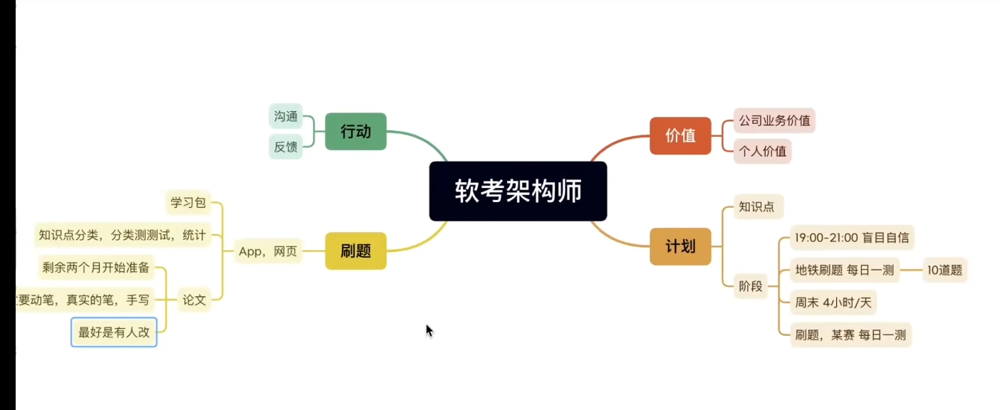

## 总体

 选择，案例分析，论文

三门每门达到45以上才算通过  

- 考前2个月再学习比较好
- 不要啃教材，很多不考，看高频考点即可
- 看红宝书知识点学习，教材只用来巩固
- 少看视频

上半年报名时间 3月左右 考试 5.24 - 5.25   

下半年报名时间 8月左右  考试11月

论文最少需要花费两个月时间去准备

报名网站

https://www.ruankao.org.cn/guide